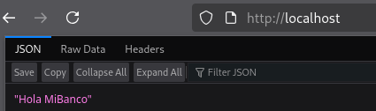
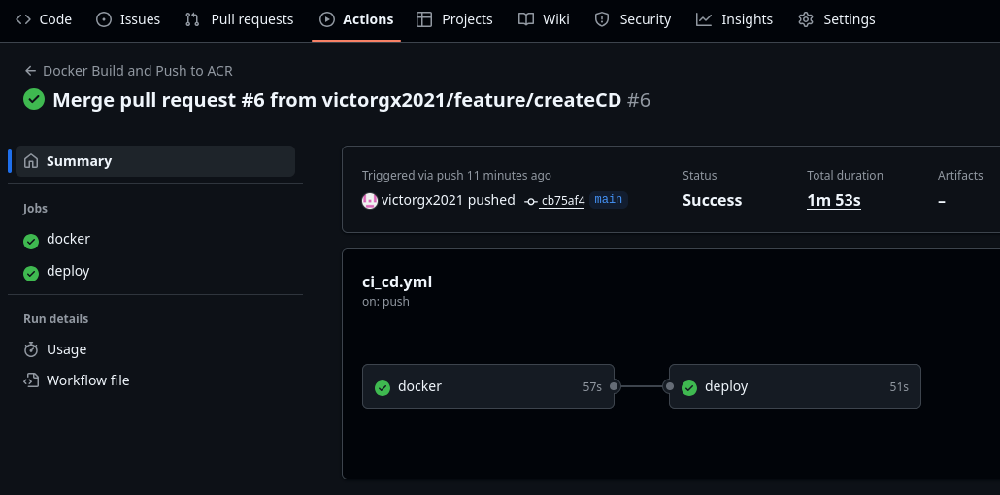
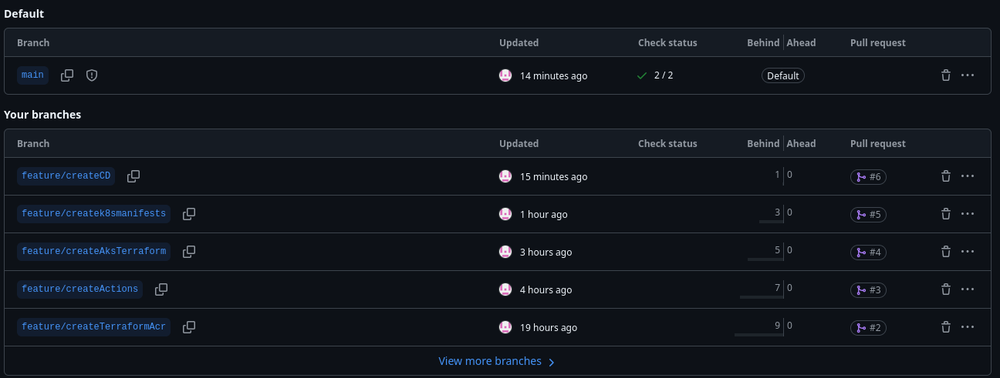
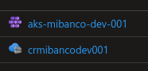
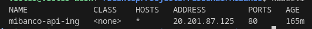
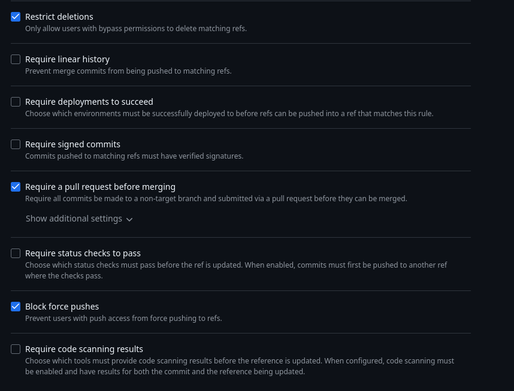
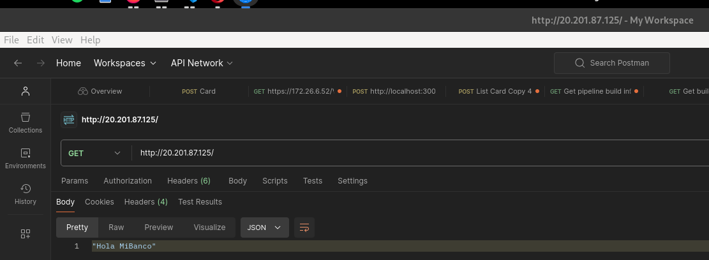
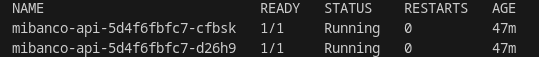

# Challenge Técnico
## 01. Requisitos Funcionales
- Implementa una aplicación de muestra con el lenguaje de su preferencia.  Es suficiente que solo diga “Hola Mibanco”

    

- Automatización con GitHub Actions

    [Ver código](.github/workflows/ci_cd.yml)

    El resultado es:

    

- Usar metodología Git Flow:

    

    Lo optimo sería tener una rama principal adicional (dev) como mínimo.
    Además de proyectos avanzados tienen las ramas de hotfix.

- Creación de recursos nube automatizado (AKS, ingress y ACR). Puede ser el comando “az” en bash o usar terraform la herramienta que mejor sea fácil. NOTA: Solo es necesario la configuración mínima.

    Se creo scripts de terraform: [Ver código](DevOps/Terraform/)

## Requisitos Técnicos:
1. Construcción de AKS, ingress controller y ACR. (El AKS y ACR pueden ser públicos)

    - En caso de aks y acr se crearon con terraform:

        - [aks](DevOps/Terraform/modules/aks/)
        - [acr](DevOps/Terraform/modules/container_registry/)

        

    - En caso de ingress controller se creo en el kubernetes mismo con helm:

        ```bash
        helm repo add ingress-nginx https://kubernetes.github.io/ingress-nginx
        helm repo update

        helm install ingress-nginx ingress-nginx/ingress-nginx \
          --namespace ingress-nginx --create-namespace \
          --set controller.service.type=LoadBalancer
        ```

2. Compilación de microservicio y debe ser subido a un ACR.

    [Ver lineas 23 a 30](https://github.com/victorgx2021/MiBancoApi/blob/main/.github/workflows/ci_cd.yml#L23-L30)

3. Despliegue automático de la aplicación en el clúster AKS configurado anteriormente. Se debe de contar con los siguientes manifiestos de kubernetes:
    - [Deployment.yml](DevOps/Kubernetes/deployment.yaml)
    - [service.yml](DevOps/Kubernetes/service.yaml)
    - [hpa.yml](DevOps/Kubernetes/hpa.yaml)
    - [ingress.yml](DevOps/Kubernetes/ingress.yaml)

    Adicionalmente
    
    - [namespace.yaml](DevOps/Kubernetes/namespace.yaml)
    - Crear un secreto con las credenciales de acr:

        ```bash
        az acr credential show --name crmibancodev001
        kubectl -n mibanco create secret docker-registry acr \
            --docker-server=crmibancodev001.azurecr.io  \
            --docker-username=<username>  \
            --docker-password=<password>
        ```

    Acerca del despliegue automático:
    [Ver lineas 49 a 50](https://github.com/victorgx2021/MiBancoApi/blob/main/.github/workflows/ci_cd.yml#L49-L50)

> [!WARNING]
> ⚠️ Desde la version con tag v1.3.0 esta deshabilitado ya que se usa helm, y la actualizacion de la imagen a usar es diferente, explicado en la ultima sección de este documento.

4. Validación de pods desplegados en el AKS, así como también el ingress. (Ejem: Se puede crear un task que ejecute el comando # kubectl get pods, para su validación)

    - Pods desplegados:
    [Ver lineas 52 a 53](https://github.com/victorgx2021/MiBancoApi/blob/main/.github/workflows/ci_cd.yml#L52-L53)

> [!WARNING]
> ⚠️ Desde la version con tag v1.3.0 esta deshabilitado ya que se usa helm, helm con un tag "--wait", espera a que todo sea actualizado.

    - Ingress:

        

5. Habilitar políticas y/o permisos de pull request approvals

    

## Evaluación
- Código fuente y archivos de configuración en un repositorio de GitHub. En caso no se pueda compartir enviar un ZIP.

    [GitHub link](https://github.com/victorgx2021/MiBancoApi)

- Capturas de pantalla de postman obteniendo el mensaje de saludo indicado.

    

- Capturas de pantalla del flujo CI/CD y pod desplegado en AKS.

    - Flujo CI/CD

        

    - Pods desplegados

        

---
> [!IMPORTANT]
> ## Adicionales
# Helm
En vez de solo usar despliegues, crear un [helm chart](DevOps/helm/).
Para instalar, al estar en el directorio raiz del repositorio:
```bash
helm -n mibanco install mibanco ./DevOps/helm/
```
Con esto se debe actualizar el job en github action para el CD.
[Ver lineas 55 a 61](https://github.com/victorgx2021/MiBancoApi/blob/main/.github/workflows/ci_cd.yml#L55-L61)
