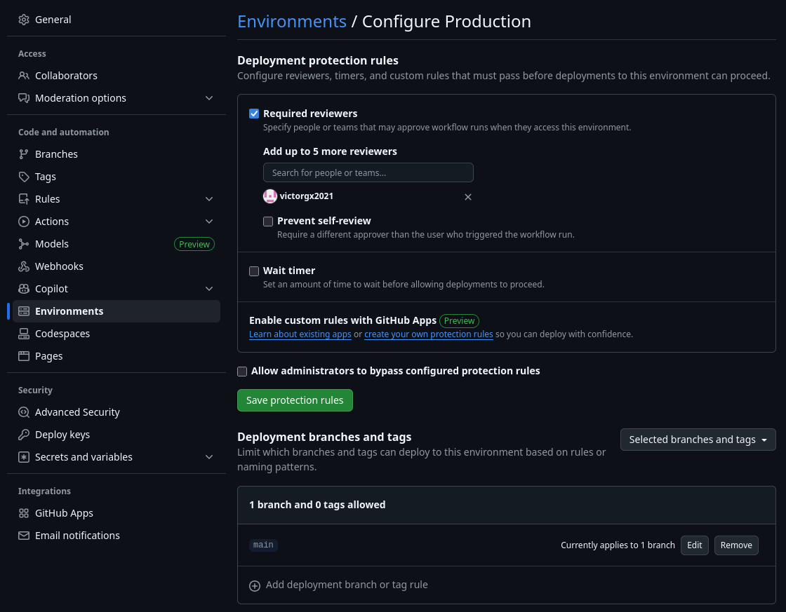
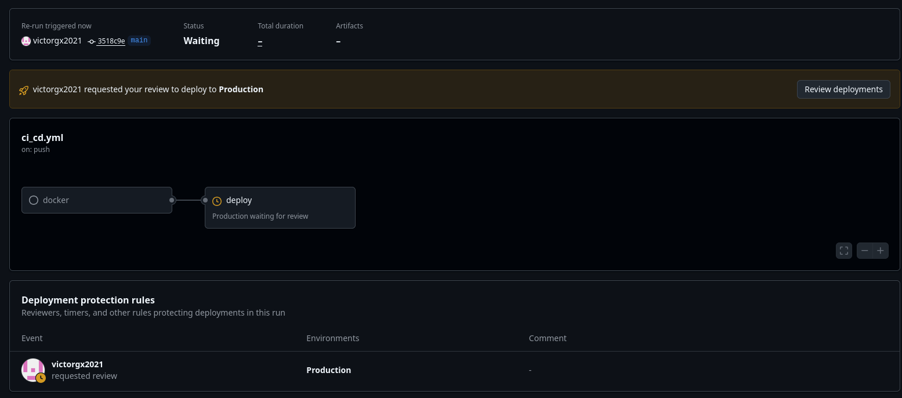
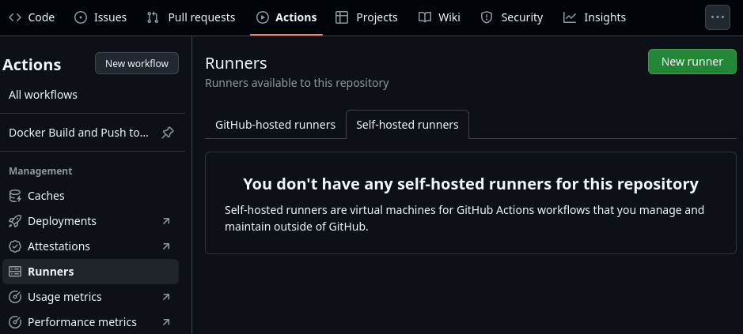
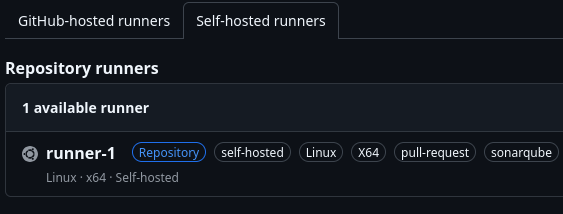
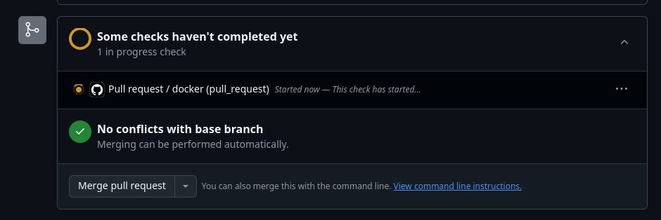
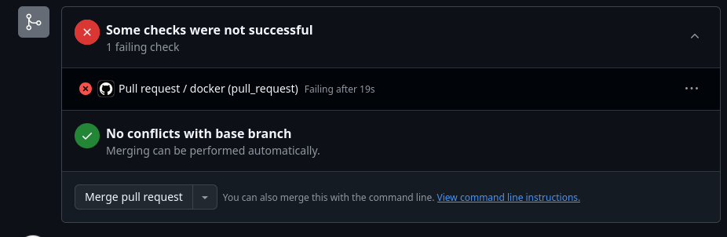
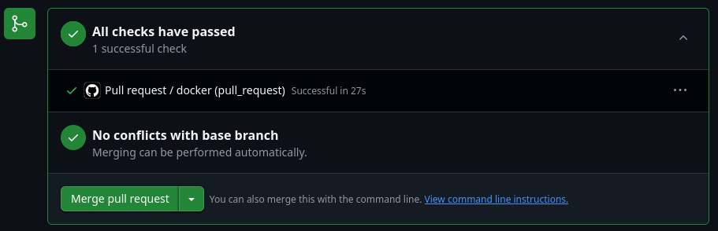

# Challenge Técnico
## 01. Requisitos Funcionales
- Implementa una aplicación de muestra con el lenguaje de su preferencia.  Es suficiente que solo diga “Hola Mibanco”

    

- Automatización con GitHub Actions

    [Ver código](.github/workflows/ci_cd.yml)

    El resultado es:

    

- Usar metodología Git Flow:

    

    Lo optimo sería tener una rama principal adicional (dev) como mínimo.
    Además de proyectos avanzados tienen las ramas de hotfix.

- Creación de recursos nube automatizado (AKS, ingress y ACR). Puede ser el comando “az” en bash o usar terraform la herramienta que mejor sea fácil. NOTA: Solo es necesario la configuración mínima.

    Se creo scripts de terraform: [Ver código](DevOps/Terraform/)

## Requisitos Técnicos:
1. Construcción de AKS, ingress controller y ACR. (El AKS y ACR pueden ser públicos)

    - En caso de aks y acr se crearon con terraform:

        - [aks](DevOps/Terraform/modules/aks/)
        - [acr](DevOps/Terraform/modules/container_registry/)

        

    - En caso de ingress controller se creo en el kubernetes mismo con helm:

        ```bash
        helm repo add ingress-nginx https://kubernetes.github.io/ingress-nginx
        helm repo update

        helm install ingress-nginx ingress-nginx/ingress-nginx \
          --namespace ingress-nginx --create-namespace \
          --set controller.service.type=LoadBalancer
        ```

2. Compilación de microservicio y debe ser subido a un ACR.

    [Ver lineas 23 a 30](https://github.com/victorgx2021/MiBancoApi/blob/main/.github/workflows/ci_cd.yml#L23-L30)

3. Despliegue automático de la aplicación en el clúster AKS configurado anteriormente. Se debe de contar con los siguientes manifiestos de kubernetes:
    - [Deployment.yml](DevOps/Kubernetes/deployment.yaml)
    - [service.yml](DevOps/Kubernetes/service.yaml)
    - [hpa.yml](DevOps/Kubernetes/hpa.yaml)
    - [ingress.yml](DevOps/Kubernetes/ingress.yaml)

    Adicionalmente
    
    - [namespace.yaml](DevOps/Kubernetes/namespace.yaml)
    - Crear un secreto con las credenciales de acr:

        ```bash
        az acr credential show --name crmibancodev001
        kubectl -n mibanco create secret docker-registry acr \
            --docker-server=crmibancodev001.azurecr.io  \
            --docker-username=<username>  \
            --docker-password=<password>
        ```

    Acerca del despliegue automático:
    [Ver lineas 50 a 51](https://github.com/victorgx2021/MiBancoApi/blob/main/.github/workflows/ci_cd.yml#L50-L51)

> [!WARNING]
> ⚠️ Desde la version con tag v1.3.0 esta deshabilitado ya que se usa helm, y la actualizacion de la imagen a usar es diferente, explicado en la ultima sección de este documento.

4. Validación de pods desplegados en el AKS, así como también el ingress. (Ejem: Se puede crear un task que ejecute el comando # kubectl get pods, para su validación)

    - Pods desplegados:
    [Ver lineas 53 a 54](https://github.com/victorgx2021/MiBancoApi/blob/main/.github/workflows/ci_cd.yml#L53-L54)

> [!WARNING]
> ⚠️ Desde la version con tag v1.3.0 esta deshabilitado ya que se usa helm, helm con un tag "--wait", espera a que todo sea actualizado.

    - Ingress:

        

5. Habilitar políticas y/o permisos de pull request approvals

    

## Evaluación
- Código fuente y archivos de configuración en un repositorio de GitHub. En caso no se pueda compartir enviar un ZIP.

    [GitHub link](https://github.com/victorgx2021/MiBancoApi)

- Capturas de pantalla de postman obteniendo el mensaje de saludo indicado.

    

- Capturas de pantalla del flujo CI/CD y pod desplegado en AKS.

    - Flujo CI/CD

        

    - Pods desplegados

        

---
> [!IMPORTANT]
> ## Adicionales
### Helm
En vez de solo usar despliegues, crear un [helm chart](DevOps/helm/).
Para instalar, al estar en el directorio raiz del repositorio:
```bash
helm -n mibanco install mibanco ./DevOps/helm/
```
Con esto se debe actualizar el job en github action para el CD.
[Ver lineas 56 a 62](https://github.com/victorgx2021/MiBancoApi/blob/main/.github/workflows/ci_cd.yml#L56-L62)

### Aprobaciones para despliegues
Si por ejemplo tenemos 3 ambientes (dev, qa, prod), dependiendo del proyecto,
los despliegues de dev y qa deben ser inmediatos, pero los despliegues
en producción debería ser con aprobaciones, ya que deberían ser desplegados
en horario no laboral de los clientes (excepto claro hotfix urgentes).

- Primero configurar un environment en GitHub actions.

    

- Segundo agregar el environment en el flujo de CD: [Ver lineas 34 a 35](https://github.com/victorgx2021/MiBancoApi/blob/main/.github/workflows/ci_cd.yml#L34-L35)



### Self-hosted runners
Un Runner auto hosteado puede tener herramientas pre instaladas que los Runners de Github no tienen.
También se puede acceder a recursos locales que no están expuesto a internet.
1. Agregar un nuevo Runner tiene opciones:
    - Siguiendo la imagen te da los pasos para crear un Runner de manera manual.

        
    - Crear como contenedor de docker: [Archivos docker](DevOps/Docker/Runner/)
        - Tener en consideración que se debe tener un archivo .env

            ```env
            GH_TOKEN=AAAAAAAAAAAAAAAAAAAAAAAAAAA
            GH_URL=https://github.com/victorgx2021/MiBancoApi
            RUNNER_NAME=runner-1
            RUNNER_LABELS=pull-request,sonarqube
            ```

            Se observa que existe un env "RUNNER_LABELS", esto es para que
            nuestro Runner, tenga como etiquetas ese contenido (otros vienen por defecto):

            

            Para luego indicar en nuestro workflow en que runner correr: [Ver linea 13](https://github.com/victorgx2021/MiBancoApi/blob/main/.github/workflows/pull_request.yml#L13)

### Workflow para pull request
Al agregar un workflow para cuando se crea o actualiza un pull request
([Ver linea 4 a 6](https://github.com/victorgx2021/MiBancoApi/blob/main/.github/workflows/pull_request.yml#L4-L6)), se puede observar:



No podra aprobarse el pull request hasta que termine de ejecutarse el workflow o falle:



Una vez que termine exitosamente el workflow, se puede aprobar el pull request (si no lo impide otras políticas):


